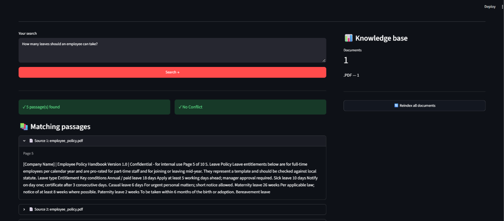

# EnterpriseIQ — Enterprise Document Intelligence

Search your organization's documents by meaning, not just keywords.

Upload PDFs, Word files, CSVs and Excel sheets, type a question in plain
English, and EnterpriseIQ finds the most relevant passages — with the file
name and the page, sheet or row — and, optionally, writes a short answer
from them using Google Gemini, so you can see exactly where the information
comes from.




## What you can do

- **Keep organizations separate** — each organization has its own documents and its own search index, so results never mix.
- **Upload documents** — PDF, DOCX, CSV, XLSX and XLS.
- **Search by meaning and by exact words** — "Who manages Aditi Sharma?" finds the right passage even if the wording differs, and names, cities and IDs (like `ZX-1802`) are matched exactly.
- **Get a written answer (optional)** — with a Gemini key, the app answers from the passages it found, including simple counts like "how many employees are in Austin?".
- **See the evidence** — every result shows its source file and the page, section, sheet or row it came from.
- **Spot conflicts** — if the retrieved passages contradict each other, the app flags it.
- **Reindex anytime** — rebuild an organization's search index with one click.

## How it works

```
Upload  →  Parse  →  Chunk  →  Embed  →  Store in Chroma
                                              │
Question  ──┬─ Meaning search (embeddings) ──┐
            └─ Keyword search (BM25) ────────┴─ Merge rankings
                                                    │
                                   Conflict check  →  Show passages with sources
```

1. **Parse** — text is extracted from each file (pages for PDFs, sheets and rows for spreadsheets).
2. **Chunk** — text is split into ~800-character pieces with a small overlap.
3. **Embed** — each chunk is turned into a vector with a local model (`all-MiniLM-L6-v2`).
4. **Store** — vectors go into a Chroma database, one collection per organization.
5. **Search** — two searches run side by side: a meaning search (your question is embedded the same way and the closest chunks are found) and a keyword search (BM25, which finds chunks containing your exact words). The two rankings are merged, so a passage found by both ranks first.
6. **Answer (optional)** — the top passages are sent to Gemini, which writes an answer using only that text. The flow is a small LangGraph workflow: retrieve → detect conflicts → check evidence → generate answer → build evidence.

> The answer is only as complete as the passages found. For counting questions over large files, check the listed passages too.

## Getting started

**Requirements:** Python 3.10+

```bash
# 1. Create and activate a virtual environment
python -m venv venv
venv\Scripts\activate          # Windows
# source venv/bin/activate     # macOS / Linux

# 2. Install dependencies
pip install -r requirements.txt

# 3. Run the app
streamlit run ui.py
```

Then open http://localhost:8501.

The first run downloads the embedding model, so it needs an internet
connection once.

### Run with Docker

No Python setup needed — just [Docker](https://www.docker.com/products/docker-desktop/).

```bash
docker compose up --build
```

Then open http://localhost:8501.

- The embedding model is built into the image, so the container works offline.
- Your uploads, search index and organizations are stored in a Docker volume (`enterpriseiq_data`), so they survive restarts and rebuilds.
- Stop with `docker compose down`. To also delete all stored data, use `docker compose down -v`.

### Enable AI answers (optional)

1. Get a free key at https://aistudio.google.com/apikey.
2. Copy `.env.example` to `.env` and paste the key:
   ```
   GEMINI_API_KEY=your_key_here
   ```
3. Restart the app. With Docker, `docker compose up --build` reads the same `.env` file.

## Using the app

1. **Create an organization** (e.g. "Acme Corp") or select an existing one.
2. **Upload documents** — they are indexed automatically.
3. **Search** — type a question and click **Search**.
4. Open any result to read the full passage and see where it came from.

## Where your data is stored

Everything is saved in the `data/` folder, relative to where you start the app (the project root). Nothing is sent to a database or cloud storage.

| What | Where |
|---|---|
| Uploaded files | `data/raw/<organization>/` — one folder per organization, e.g. `data/raw/acme_corp/report.pdf` |
| Search index (chunks and embeddings) | `data/chroma/` — one Chroma collection per organization |
| List of organizations | `data/organizations.json` |

- **Switching organizations** never mixes data: each has its own folder and its own index.
- **Reindexing** rebuilds an organization's index from the files in its folder.
- **Deleting an organization's data:** remove its folder under `data/raw/`, and delete `data/chroma/` (or just that organization's entry) to clear the index.
- **Embedding model:** downloaded once to the Hugging Face cache (`~/.cache/huggingface`), not to `data/`.
- **Privacy:** `data/` is listed in `.gitignore`, so your documents are never committed to GitHub.

**With Docker**, `data/` lives inside the container at `/app/data`, backed by the `enterpriseiq_data` volume. It survives restarts and rebuilds, and `docker compose down -v` deletes it. To keep the files in a normal folder on your computer instead, change the volume line in `docker-compose.yml` to `./data:/app/data`.

**On Streamlit Community Cloud**, the disk is temporary. Uploaded files and the index are erased whenever the app restarts or goes to sleep, so you have to upload documents again.

## Built with

Python · Streamlit · LangGraph · LangChain · Chroma · Hugging Face sentence-transformers · Google Gemini · Pydantic
